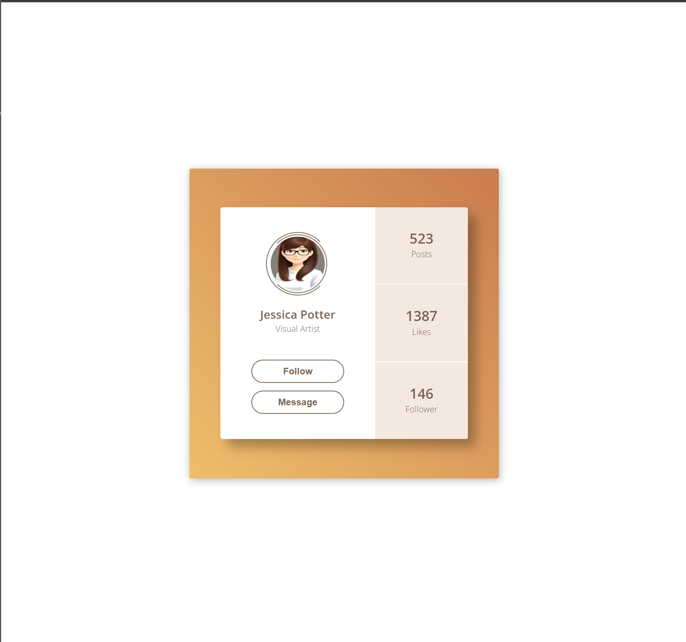

<h1>Profile Challenge</h1>

<h2>Overview</h2>

<strong>Profile Challenge</strong> is a unique project designed to encourage participants to create a new social media profile from scratch. This project aims to foster creativity, introspection, and a deeper understanding of personal online representation.

<h2>Table of Contents</h2>
<ol>
    <li><a href="#introduction">Introduction</a></li>
    <li><a href="#preview">Preview</a></li>
    <li><a href="#objective">Objective</a></li>
    <li><a href="#requirements">Requirements</a></li>
    <li><a href="#installation">Installation</a></li>
    <li><a href="#usage">Usage</a></li>
    <li><a href="#project-structure">Project Structure</a></li>
    <li><a href="#styling">Styling</a></li>
    <li><a href="#challenges">Challenges</a></li>
    <li><a href="#contributing">Contributing</a></li>
    <li><a href="#contact">Contact</a></li>
    <li><a href="#Credits">Credits</a></li>
</ol>

<h2 id="introduction">Introduction</h2>

Welcome to the <strong>Profile Challenge</strong>! This project invites you to create a new social media profile, providing a fun and engaging way to explore your online identity. Reflect on the profiles you've made in the past and craft a new one that represents your current self or aspirations.

<h2 id="preview">Preview</h2>

<h2 id="objective">Objective</h2>

The main objective of the <strong>Profile Challenge</strong> is to:

<ul>
    <li>Encourage self-reflection about your online presence.</li>
    <li>Promote creativity in designing personal profiles.</li>
    <li>Highlight how personal identities evolve over time.</li>
    <li>Provide an engaging activity that can be shared and enjoyed with others.</li>
</ul>

<h2 id="requirements">Requirements</h2>

To participate in the <strong>Profile Challenge</strong>, you will need:

<ul>
    <li>A text editor (e.g., VSCode, Sublime Text).</li>
    <li>Basic knowledge of HTML and CSS.</li>
    <li>Creativity and willingness to explore your online identity.</li>
</ul>

<h2 id="installation">Installation</h2>

There is no specific software installation required for this challenge. However, you may use the following tools for an enhanced experience:

<ul>
    <li><strong>Text Editors</strong>: VSCode, Sublime Text, Atom.</li>
    <li><strong>Web Browsers</strong>: Chrome, Firefox, Edge.</li>
    <li><strong>Design Tools</strong>: Figma, Adobe XD for mockups (optional).</li>
</ul>

<h2 id="usage">Usage</h2>

To create and submit your profile:

<ol>
    <li><strong>Reflect on Past Profiles</strong>: Think about the social media profiles you have created over time.</li>
    <li><strong>Create a New Profile</strong>: Design a new profile using HTML and CSS including the following elements:
        <ul>
            <li>Profile Picture</li>
            <li>Username</li>
            <li>Bio/Description</li>
            <li>Interests/Hobbies</li>
            <li>Contact Information (optional)</li>
        </ul>
    </li>
    <li><strong>Submit Your Profile</strong>: Document your profile and submit it along with a brief explanation (300-500 words) of your thought process.</li>
</ol>

<h2 id="project-structure">Project Structure</h2>

The project repository is structured as follows:

<pre>
Day-06-Profile/
│
├── README.md
├── /images
│   └── profile_example.png
├── index.html
└── styles.css
</pre>

<h2 id="styling">Styling</h2>

Feel free to style your profile as creatively as you wish. You can use any color schemes, fonts, and layouts that best represent your identity. Utilize HTML and CSS to enhance the visual appeal of your profile.

<h2 id="challenges">Challenges</h2>

Some challenges you may encounter include:

<ul>
    <li>Deciding on a unique and authentic representation of yourself.</li>
    <li>Balancing creativity with personal authenticity.</li>
    <li>Finding the right tools and resources for designing your profile.</li>
</ul>

<h2 id="contributing">Contributing</h2>

We welcome contributions to the <strong>Profile Challenge</strong>! Your involvement can help improve the project and make it more engaging for participants. Below are the guidelines for contributing:

<h3>How to Contribute</h3>
<ol>
    <li><strong>Fork the Repository</strong>:
        <ul>
            <li>Go to the <a href="https://github.com/Yashi-Singh-1/Day-06-Profile">Profile Challenge GitHub Repository</a>.</li>
            <li>Click the "Fork" button in the top-right corner of the repository page.</li>
        </ul>
    </li>
    <li><strong>Clone the Repository</strong>:
        <ul>
            <li>Clone your forked repository to your local machine using the following command:</li>
        </ul>
        <pre>
git clone https://github.com/YOUR-USERNAME/Day-06-Profile.git
        </pre>
        <ul>
            <li>Replace <code>YOUR-USERNAME</code> with your GitHub username.</li>
        </ul>
    </li>
    <li><strong>Create a New Branch</strong>:
        <ul>
            <li>Navigate to the repository directory:</li>
        </ul>
        <pre>
cd Day-06-Profile
        </pre>
        <ul>
            <li>Create a new branch for your changes:</li>
        </ul>
        <pre>
git checkout -b your-branch-name
        </pre>
        <ul>
            <li>Use a descriptive name for your branch, such as <code>improve-readme</code> or <code>add-new-feature</code>.</li>
        </ul>
    </li>
    <li><strong>Make Your Changes</strong>:
        <ul>
            <li>Implement your changes to the project. This could include:</li>
            <ul>
                <li>Improving documentation.</li>
                <li>Adding new features or elements to the challenge.</li>
                <li>Fixing bugs or issues.</li>
                <li>Enhancing the visual design of example profiles.</li>
            </ul>
            <li>Ensure your changes adhere to the project's style and guidelines.</li>
        </ul>
    </li>
    <li><strong>Commit Your Changes</strong>:
        <ul>
            <li>Add the files you changed to the staging area:</li>
        </ul>
        <pre>
git add .
        </pre>
        <ul>
            <li>Commit your changes with a descriptive commit message:</li>
        </ul>
        <pre>
git commit -m "Description of your changes"
        </pre>
    </li>
    <li><strong>Push to Your Fork</strong>:
        <ul>
            <li>Push your changes to your forked repository:</li>
        </ul>
        <pre>
git push origin your-branch-name
        </pre>
    </li>
    <li><strong>Create a Pull Request</strong>:
        <ul>
            <li>Go to the original repository on GitHub.</li>
            <li>You should see a message about your recently pushed branch and a button to create a pull request.</li>
            <li>Click "Compare & pull request".</li>
            <li>Fill out the pull request template, providing a clear description of your changes.</li>
            <li>Submit the pull request.</li>
        </ul>
    </li>
</ol>

<h2 id="contact">Contact</h2>

For any questions or further assistance, feel free to reach out:

<ul>
    <li><strong>GitHub Profile</strong>: <a href="https://github.com/Yashi-Singh-1">Yashi Singh</a></li>
    <li><strong>LinkedIn</strong>: Yashi Singh on <a href="https://www.linkedin.com/in/yashi-singh-b4143a246" target="_blank">LinkedIn</a></li>
</ul>

<h2 id="credits">Credits</h2>

Credits to the design inspiration for the profile layout goes to <a href="https://100dayscss.com/days/6/">100 Days CSS - Day 6</a>.

We hope you enjoy the <strong>Profile Challenge</strong> and take this opportunity to explore and express your online identity in a fun and creative way!
